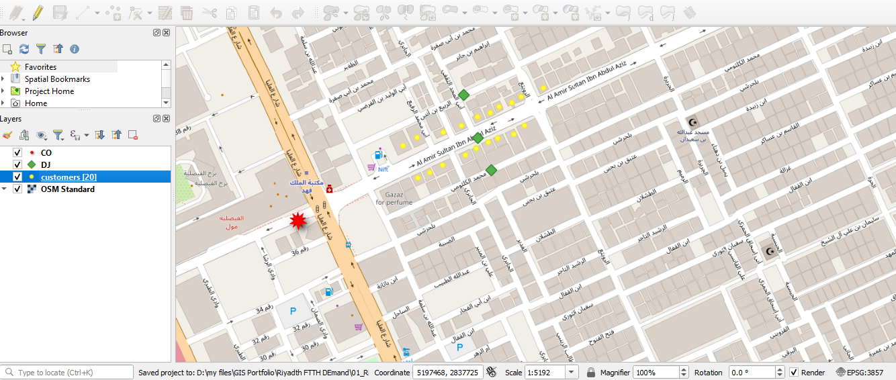

# Telecom GIS Portfolio

GIS projects for fiber network planning in Saudi Arabia.

## Project 1: Al-Olaya FTTH Network Topology
- Location: Al-Olaya, Riyadh
- Customers: 20 points
- Distribution Points: 3
- Central Office: 1
- Tools: QGIS, OpenStreetMap

## Skills
- QGIS
- Spatial Analysis
- Network Planning
- OpenStreetMap

## Contact
tallalbut3335@gmail.com
